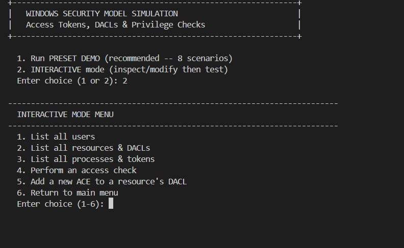
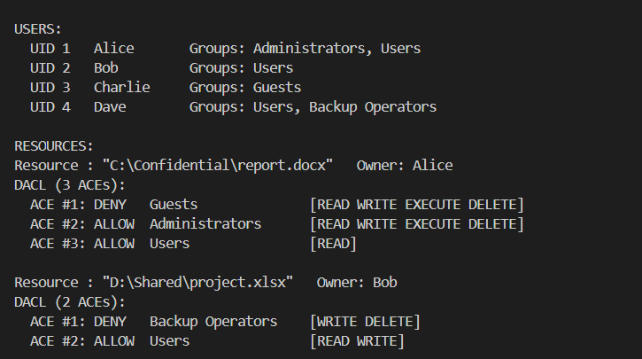
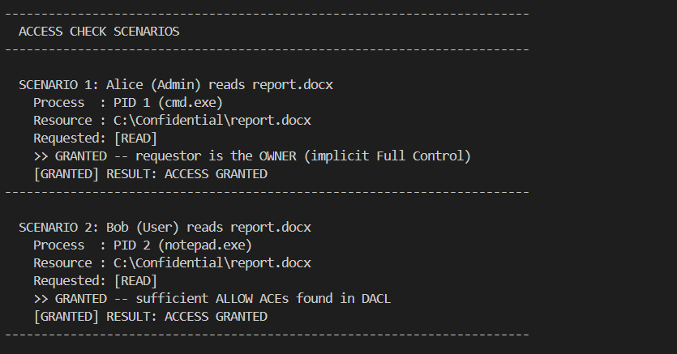

# Windows Security Simulator: Access Tokens & DACLs

An educational Operating System Security Simulator in C that models how **Microsoft Windows NT** manages authorization, process credentials, and resource access control.

---

## What It Simulates

This project simulates the core mechanisms Windows uses to determine whether a process is allowed to access securable resources (such as files, registry keys, and system services):

### 1. Access Tokens
In Windows, every process executes within the security context of an **Access Token**. The simulator models:
* **User SID (Security Identifier):** Identifies the user account that owns the process.
* **Group SIDs:** A list of groups the user belongs to (e.g., `Administrators`, `Users`, `Backup Operators`, `Guests`).
* **Privileges:** Special system-wide capabilities that can bypass standard security checks (e.g., `SeBackupPrivilege`).

---

### 2. Security Descriptors & DACLs
Every protected object in the operating system has a **Security Descriptor** containing:
* **Owner SID:** The user who owns the resource.
* **DACL (Discretionary Access Control List):** An ordered array of **Access Control Entries (ACEs)**. Each ACE specifies:
  * **Type:** `ALLOW` or `DENY`
  * **Trustee:** The targeted user SID or group SID
  * **Rights Bitmask:** `READ`, `WRITE`, `EXECUTE`, `DELETE`

---

### 3. The Windows ACE Evaluation Algorithm
When a process requests permissions against a resource, the simulator executes the real Windows DACL evaluation logic:

```text
Process Requests Rights (e.g., READ, WRITE)
                  |
                  v
         Is process the OWNER?
            /            \
        (Yes)            (No)
          |                |
  [ACCESS GRANTED]         v
  (Implicit Full Control)  Walk DACL ACEs in order (1 to N):
                           - Does ACE match Process Token (User or Group SID)?
                                  |
                                (Yes)
                                  |
                           Is ACE type DENY?
                              /       \
                          (Yes)       (No, ALLOW)
                            |              |
                      Does it cover any    Accumulate rights
                      requested rights?    into Granted Mask
                            |              |
                          (Yes)            v
                            |          Are all requested
                     [ACCESS DENIED]   rights satisfied?
                     (Immediate halt)     /        \
                                       (Yes)       (No)
                                         |           |
                                  [ACCESS GRANTED]  Continue walking ACEs...
                                                     |
                                            End of DACL reached?
                                                     |
                                              [ACCESS DENIED]
                                              (Implicit Deny)
```

1. **Owner Authority:** If the requesting token matches the resource owner, access is immediately **GRANTED** (implicit full control).
2. **Explicit Deny Precedence:** As the DACL is scanned top-to-bottom, if a matching `DENY` ACE intersects any requested right, access is immediately **DENIED** (even if a subsequent group allows it).
3. **Allow Accumulation:** Matching `ALLOW` ACEs accumulate rights until all requested rights are fulfilled.
4. **Implicit Deny:** If the DACL ends without granting all requested rights, access is rejected by default.

---

### 4. Privilege Bypass
Certain administrative operations bypass normal DACL checks when the process token holds an enabled system privilege:
* For example, backup software holding **`SeBackupPrivilege`** can read any system-protected file regardless of the DACL configuration.

---

## How to Compile & Run

### 1. Compile
Open PowerShell or Command Prompt in the project directory:

```powershell
gcc -o windows_acl.exe windows_acl.c -Wall
```

---

### 2. Run
```powershell
.\windows_acl.exe
```

When started, choose between:
* **`1` (Preset Demo - Recommended):** Automatically executes 8 curated test cases demonstrating owner access, group allowances, explicit deny, implicit deny, and privilege overrides.
* **`2` (Interactive Mode):** Inspect tokens, view resource DACLs, add custom ACEs, and test arbitrary permission requests.

---

## Program Output & Screenshots

### 1. Startup & Interactive Menu
Launch screen showing the mode selection and the interactive administration menu:



---

### 2. Loaded Security Principals & DACLs
Display of configured user accounts, group memberships, and resource DACLs with ordered ACE entries:



---

### 3. Scenario Evaluation & Decision Traces
Console output showing the reasoning trace for access decisions (owner overrides, group allowances, and explicit deny precedence):



---

## Preset Demonstration Scenarios

The included demo walks through 8 distinct real-world security scenarios:

| # | Scenario | Request | Result | Principle Demonstrated |
|---|:---|:---|:---:|:---|
| 1 | Alice reads `report.docx` | `READ` | **GRANTED** | **Owner Authority:** File owner has implicit full control. |
| 2 | Bob (member of `Users`) reads `report.docx` | `READ` | **GRANTED** | **Group Allow:** ACE grants `READ` to the `Users` group. |
| 3 | Bob writes `report.docx` | `WRITE` | **DENIED** | **Implicit Deny:** No ACE grants write access to normal users. |
| 4 | Charlie (member of `Guests`) reads `report.docx` | `READ` | **DENIED** | **Explicit Deny:** ACE #1 explicitly denies `Guests`, overriding group allow. |
| 5 | Dave (`Users` + `Backup Ops`) writes `project.xlsx` | `WRITE` | **DENIED** | **Deny Precedence:** `Backup Ops` deny ACE appears before `Users` allow ACE. |
| 6 | Dave reads `project.xlsx` | `READ` | **GRANTED** | **Targeted Deny:** Deny entry only restricts `WRITE`/`DELETE`; `READ` remains allowed. |
| 7 | Bob reads `boot.ini` | `READ` | **DENIED** | **Implicit Deny:** DACL only permits `Administrators`. |
| 8 | Dave reads `boot.ini` | `READ` | **GRANTED** | **Privilege Bypass:** Token carries `SeBackupPrivilege`, overriding the DACL. |

---

## Repository Files

| File | Purpose |
| :--- | :--- |
| `windows_acl.c` | Windows security simulator (Access Tokens, DACLs, ACE evaluation) |
| `screenshot1_menu.png` | Output screenshot: Startup and Interactive Menu |
| `screenshot2_users.png` | Output screenshot: Security Principals & DACL definitions |
| `screenshot3_scenarios.png` | Output screenshot: Access Check evaluation traces |
| `README.md` | Architecture documentation and scenario walkthrough |
| `.gitignore` | Ignores compiled binaries and IDE workspace files |
